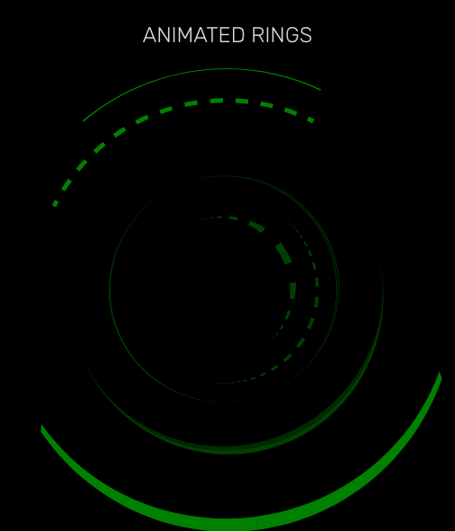
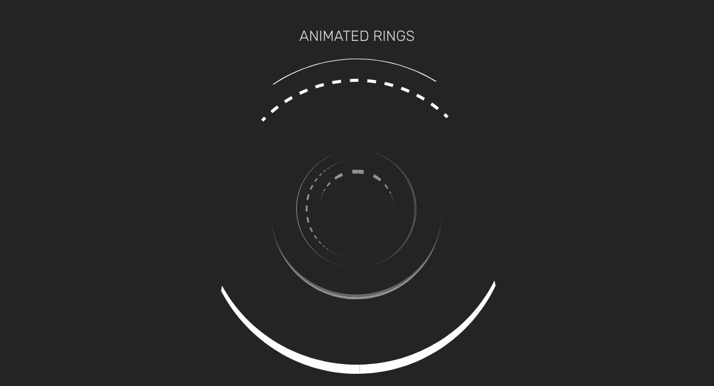
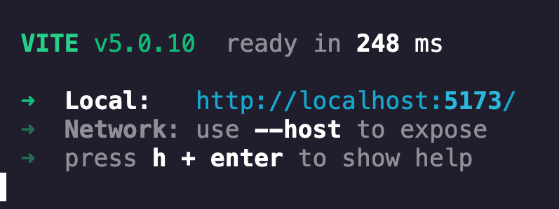

> Animated Rings with only CSS

## Preview

<center> 
    
</center>

## Installation

On your local termial type

```
git clone https://geithub.com/vinceflores/animated-rings-.git
```

Go the cloned directory

```
cd animated-ring-   
```

Run the following npm commands

`npm i` or `npm install`

I prefer 

```
npm i
```

In this project i used vite so to run it use `npm run dev`

```
    npm run dev
```

### If you did everything correct, you should get someting like

<!--  -->
<center>

</center>

# Copy and Paste to your browser. Enjoy! 